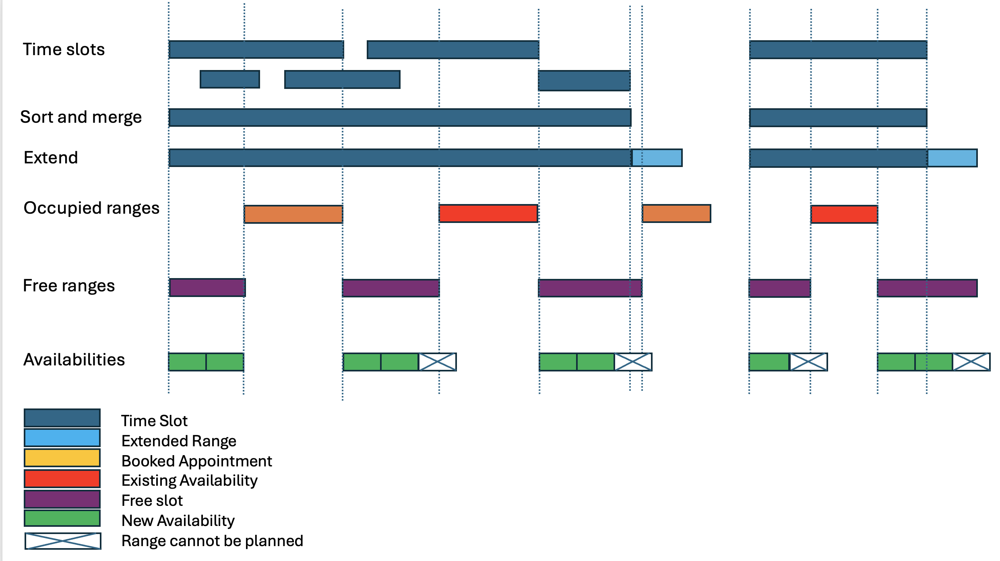
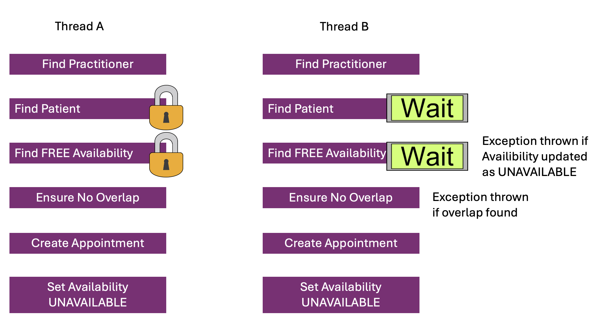
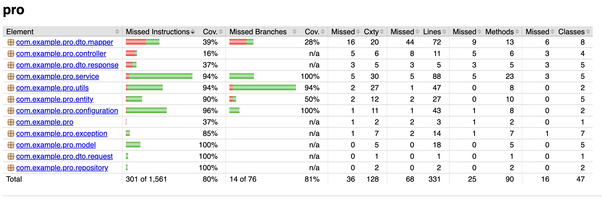

## What's changed

### Business flows
#### Generate availabilities

1. Get unplanned time slots.
2. Sort and merge overlapping time slots.
3. Extend slots to maximal duration - minutes (14 in this test) as availability could end after the slot end, if no overlapping with the next slot, appointments or availabilities (business logic confirmed before implementation).
4. Get appointments that are in slots’ range.
5. Get planned availabilities that are in slots’ range.
6. Combine appointments and availabilities as occupied ranges.
7. Sort and merge occupied ranges.
8. Subtract occupied ranges from extended slots to get free ranges.
9. Generate appointments with duration of 15 mins from free ranges.

#### Create appointments

- All steps are in one transaction with locks (patient, availability) to avoid race conditions: (different patients, same availability) and (same patient, different availabilities with overlapping time ranges) as follows:
1. Validate request
   - practitioner
   - patient (LOCK).
2. Ensure that availability (LOCK) is valid.
3. Ensure that no overlapping appointments for the given time range.
4. Change the status of availability to UNAVAILABLE.
5. Create appointment with status BOOKED. 
##### Concurrency handling example

```
Two threads, different patients, same availability:
Thread A: lock Patient 1, lock Availability X
Thread B: lock Patient 2, lock Availability X (waits for A)
Thread A: create appointment (1,X), X is UNAVAILABLE, release all locks
Thread B: availability exception as X is UNAVAILABLE-> rollback -> exit
=> only 1 appointment is created

Two threads, same patient, different availabilities but overlapping:
Thread A: lock Patient 1, lock Availability X
Thread B: lock Patient 1  (waits for A)
Thread A: create appointment (1, X), X is UNAVAILABLE, release all locks
Thread B: overlap exception as found appointment(1,X) that overlaps -> rollback -> exit
=> only 1 appointment is created
  
Two threads, different patients, different availabilities:
Thread A: lock Patient 1, lock Availability X, no wait
Thread B: lock Patient 2, lock Availability Y, no wait
Thread A: create appointment (1,X), X is UNAVAILABLE, release all locks
Thread B: create appointment (2,Y), Y is UNAVAILABLE, release all locks
=> 2 appointments are created.
```
      
### Models and Entities
- Update entities to support status
    - TimeSlot (NEW, MODIFIED, PLANNED) - MODIFIED for future support
    - Availability (FREE, UNAVAILABLE)
    - Appointment (BOOKED, CANCELLED) - CANCELLED for future support
    - State pattern could be used to handle state change, for the project scope, it's not taken into account.
- `Instant` is used instead of `LocalDateTime`, so dates will be in UTC. So, **now the UI will display date as the local date GMT+1**.
- Add a new `model` package for business logic, it's better to have different models (for business) and entities (for db persistence), but for this project scope, entities are still used to handle business logic.
- For this scope, services are kept, but it's better to define interfaces for services and controllers depend on the abstraction rather than concrete services.

### API
- New endpoint is added to create appointments `POST /appointments` ProAppointmentController. 
  - Currently, it allows creating appointment given start and end date without checking if start is in the past for demo purposes.
  - If the patient already has an overlapping appointment with another practitioner, appointment will not be made. Note: currently, UI doesn't handle this case, if you book the same slot for the same patient with a different practitioner, error displayed `An unexpected error has occurred.` in UI and need to refresh the page, and by doing so, appointment list will not be displayed correctly. It's a UI issue.

```
POST /appointments
{
    "patientId": "2",
    "practitionerId": "4",
    "startDate":"2021-02-10T09:30:00Z",
    "endDate": "2021-02-10T09:45:00Z"
}
```
dates should be in UTC format `YYYY-MM-DDTHH:mm:ssZ`

- Http code 202, 201, 400, 409, 500 supported
- DTO for API to isolate business logic and API transfer.
- Global exception handler to handle all exceptions and consistent error message. Error code is exception class for demo purpose only.

### Code
- Use bean constructor injection instead of `@Autowired`
- Unit test method name `given_when_then` for better semantic understanding
- Newer versions updated (gradle, spring boot, java)
- To avoid lots of changes when reviewing, some classes are not changed, eg. (class `ProAvailabilityServiceTest`, name of provided tests remains unchanged).

### Limit
- Tests do not cover all classes, only classes and functions related to the two main workflows are done.
- Features such as appointment cancellation and timeslot modification are not handled.

### Assumptions
- The flows might not reflect the actual business logic
- Assumptions with implemented workflows
  - Free time ranges if the duration is not enough. eg. The Slot starts at 11 AM, there is an availability at 11:25 added by practitioner, one availability 11:00-11:15 is generated and a gap from 11:15-11:25.
  - Patients could book an appointment if not overlapping with other appointments.
  - Patients could book more than one appointment with the same practitioner.


## Run and test
### Front-end setup
```
node --version
v24.3.0
```

Run
```
rm -r package-lock.json
npm install
npm run build
npm run start
```
### Project setup

Java 21 required, built locally with the version details

```
java 21.0.9 2025-10-21 LTS
Java(TM) SE Runtime Environment (build 21.0.9+7-LTS-338)
Java HotSpot(TM) 64-Bit Server VM (build 21.0.9+7-LTS-338, mixed mode, sharing)
```

### Run spring boot server

Build and start the server.

```
./gradlew build
./gradlew bootRun
```

Try it out with Swagger UI (http://localhost:8080/swagger-ui/index.html)

### H2 Console UI

H2 in memory db console could be accessed by http://localhost:8080/h2-console
Provide these connection details.

```
Driver Class:	org.h2.Driver
JDBC URL:	jdbc:h2:mem:example
User Name:	sa
Password:	password
```

### Testing

To run unit tests

```
./gradlew test
./gradlew jacocoTestReport
```
Check reports in 
```
build/reports/jacoco/test/html/index.html 
build/reports/tests/index.html

```

## Improvements
### Api
- API versioning eg. `/v1/availabilities`
- Endpoint get should support pagination eg. `/v1/availabilities?practitionerId=1&$skip=100&$top=10`
- Create appointments `POST /appointments` should not allow past appointments.
- Endpoint availabilities support filter to return the slots starting from current time.
- Add correlationId for each request for observability.

### Entity
- Better id with `uuid` (if db sharding).
- Some technical fields such as `created_at`, `modified_at`, `created_by`, `modified_by` for better audit.
- Currently, entities and business models are identical, but for the bigger project scope with potential evolutions, it's better to use separate business models for business logic, and MapStruct to convert to and from entities. It’s useful when entities could have more technical fields (eg. version).

### Feature
- Non-booked availabilities cleanup: scheduled job to delete or to mark past unbooked availabilities.

### Architecture
- Support async processing if high concurrency
    - Async api to accept the booking request.
    - Publish a message for handling asynchronously to a broker (kafka, rabbitmq…).
    - A consumer to handle the request and persist into db.
    - A new api for status checking, and front-end could use polling strategy to get the status.
- Using clean/hexagonal architecture to isolate business domain, get more flexibility if infrastructure swap, e.g. from H2 to mongodb; core domain business will not be affected.
- The application is heavy read, could adopt the pattern CQRS.

### Testing
- Could use `testcontainers` for testing with real db.